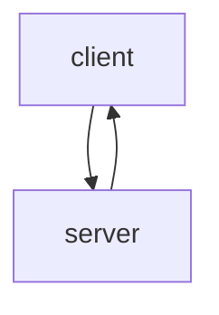
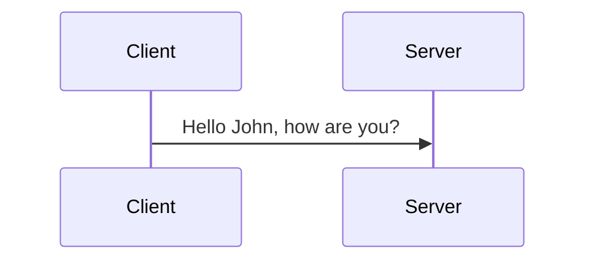

# socket_examples

- Type	Description
- ->	Solid line without arrow
- -->	Dotted line without arrow
- ->>	Solid line with arrowhead
- -->>	Dotted line with arrowhead
- -x	Solid line with a cross at the end
- --x	Dotted line with a cross at the end.
- -)	Solid line with an open arrow at the end (async)
- --)	Dotted line with a open arrow at the end (async)
* 
- actor	Style for the actor box at the top of the diagram.
- text.actor	Styles for text in the actor box at the top of the diagram.
- actor-line	The vertical line for an actor.
- messageLine0	Styles for the solid message line.
- messageLine1	Styles for the dotted message line.
- messageText	Defines styles for the text on the message arrows.
- labelBox	Defines styles label to left in a loop.
- labelText	Styles for the text in label for loops.
- loopText	Styles for the text in the loop box.
- loopLine	Defines styles for the lines in the loop box.
- note	Styles for the note box.
- noteText	Styles for the text on in the note boxes.

